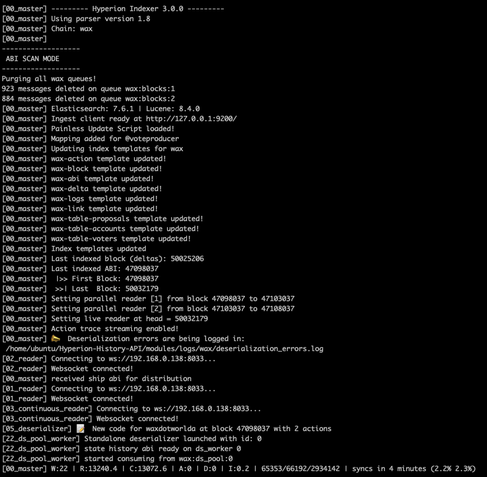

# Hyperion Setup

### 1. Clone & Install packages
```bash
git clone https://github.com/eosrio/hyperion-history-api.git
cd hyperion-history-api
npm install
```

!!! tip
    **if you came from the script section**, you can skip this step and go directly to the Edit configs step below.

<br>

### 2. Edit configs
```
cp example-ecosystem.config.js ecosystem.config.js
nano ecosystem.config.js

# Enter connection details here (chain name must match on the ecosystem file)
cp example-connections.json connections.json
nano connections.json
```

##### connections.json Reference
```json
{
   "amqp":{
      "host":"127.0.0.1:5672",
      "api":"127.0.0.1:15672",
      "user":"my_user",
      "pass":"my_password",
      "vhost":"hyperion"
   },
   "elasticsearch":{
      "host":"127.0.0.1:9200",
      "ingest_nodes":[
         "127.0.0.1:9200"
      ],
      "user":"",
      "pass":""
   },
   "redis":{
      "host":"127.0.0.1",
      "port":"6379"
   },
   "chains":{
      "eos":{
         "name":"EOS Mainnet",
         "chain_id":"aca376f206b8fc25a6ed44dbdc66547c36c6c33e3a119ffbeaef943642f0e906",
         "http":"http://127.0.0.1:8888",
         "ship":"ws://127.0.0.1:8080",
         "WS_ROUTER_PORT":7001
      }
   }
}
```
For more details, refer to the [connections section](connections.md)

<br>

##### ecosystem.config.js Reference
```javascript
module.exports = {
    apps: [
        addIndexer('eos'),
        addApiServer('eos', 1)
    ]
};
```
For more details, refer to the [ecosystem section](ecosystem.md)

<br>

### 3. Setup

```
cp chains/example.config.json chains/CHAIN_NAME.config.json

Example:
cp chains/example.config.json chains/eos.config.json
``` 
The default config.json file is ready to run. The parameter `abi_scan_mode` is `true` to perform an abi scan on the first run.

For more details, refer to the [chain section](chain.md)

<br>

### 4. Start and Stop

We provide scripts to simplify the process of starting and stopping your Hyperion Indexer or API instance.
But, you can also do it manually if you prefer. This section will cover both ways:

#### Option 1: Using run / stop script

!!! success ""
    
    ##### run script
    
    You can use `run` script to start the Indexer or the API.
    
    ```
    ./run.sh chain-indexer
    
    ./run.sh chain-api
    ```
    
    !!! example "Examples"
        Start indexing EOS mainnet: 
        ```
        ./run.sh eos-indexer
        ```
        Start EOS API: 
        ```
        ./run.sh eos-api
        ```

Remember that the chain name was previously defined in the [setup step](#3-setup).

!!! failure ""

    ##### stop script
    
    The `stop` script follows the same pattern of the `run` script:
    ```
    ./stop.sh chain-indexer
    
    ./stop.sh chain-api
    ```
    !!! example
        Stop the EOS mainnet indexer: 
        ```
        ./stop.sh eos-indexer
        ```
    !!! note  
        **The stop script won't stop Hyperion Indexer immediately**, it will first flush the queues.
        This operation could take some time.
        If you want to stop immediately, you need to run the "force stop command" explained below.


<br>

#### Option 2: Commands

##### Start indexing:
```
pm2 start --only chain-indexer --update-env
pm2 logs chain-indexer
```

##### Stop reading and wait for queues to flush:
```
pm2 trigger chain-indexer stop
```

##### Force stop:
```
pm2 stop chain-indexer
```

##### Starting the API node:
```
pm2 start --only chain-api --update-env
pm2 logs chain-api
```

<br>

### 6. Indexer
As mentioned before on [Setup](#3-setup), the Hyperion Indexer is configured to perform an abi scan `("abi_scan_mode": true)` as default.
So, on your first run, you'll probably see something like this:

 [](img/indexer.png)
 
This an example of an ABI SCAN on the WAX chain.

Where: 
    
  - W (Workers): Number of workers.
  - R (Read): Blocks read from state history and pushing into the blocks queue.
  - C (Consumed): Blocks consumed from blocks queue.
  - A (Actions): Actions being read out of processed blocks.
  - D (Deserialized): Deserializations of the actions.
  - I (Indexed): Indexing of all of the docs.

<br>

### 7. API
After running the api, you should see a log like this:

 [](img/api.png)

Now, it's time to play around making some queries. :fontawesome-regular-laugh-beam:

### API Reference

API Reference: [API section: v2](v2.md)

Example: [OpenAPI Docs](https://eos.hyperion.eosrio.io/v2/docs)

<br>
