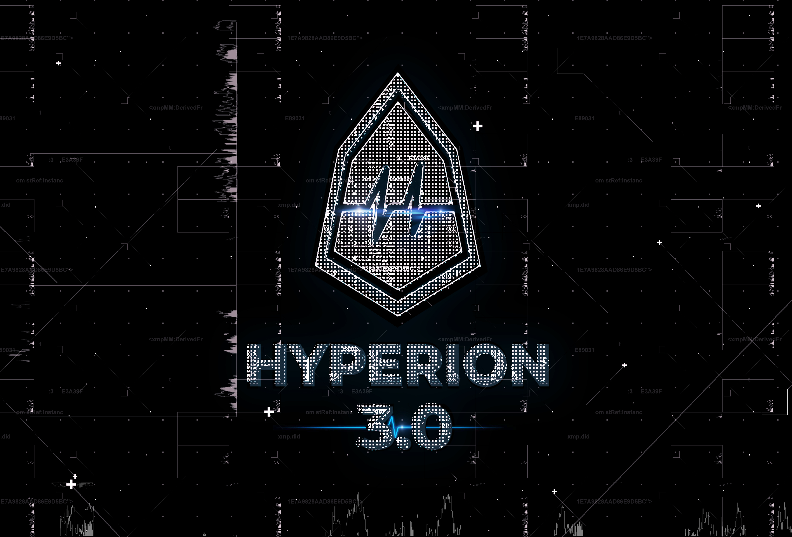

# Hyperion History API

!!! abstract ""
    Scalable Full History API Solution for EOSIO based blockchains
      
    Made with ♥ by [EOS Rio](https://eosrio.io/)
      

### 1. Overview

Hyperion is a full history solution for indexing, storing and retrieving EOSIO blockchain`s historical data. 
EOSIO protocol is highly scalable, reaching up to tens of thousands of transactions per second, demanding high-performance indexing and optimized storage and querying solutions.
Hyperion is developed to tackle those challenges providing open-source software to be operated by block producers, infrastructure providers and dApp developers.
Focused on delivering faster search times, lower bandwidth overhead and easier usability for UI/UX developers, Hyperion implements an improved data structure:

   - actions are stored in a flattened format;  
   - a parent field is added to the inline actions to point to the parent global sequence
   - if the inline action data is identical to the parent, it is considered a notification and thus removed from the database.
 
No blocks or transaction data are stored; all information can be reconstructed from actions.

### 2. Architecture
The following components are required to have a fully functional Hyperion API deployment.

!!! tip
    For small use cases, it is fine to run all components on a single machine. But for larger chains and production environments, 
    we recommend setting them up into different servers under a high-speed local network.

#### 2.1 - Elasticsearch Cluster
The ES cluster is responsible for storing all indexed data. Direct access to the Hyperion API and Indexer must be provided. 

We recommend nodes in the cluster to have at least 32GB of RAM and 8 CPU cores. SSD/NVME drives are recommended for maximum indexing throughput.

For production environments, a multi-node cluster is highly recommended.

#### 2.2 - Hyperion Indexer
The indexer is a Node.js based app that processes data from the state history plugin and allows it to be indexed. 

The PM2 process manager is used to launch and operate the indexer. The configuration flexibility is very extensive, so system recommendations depend on the use case and data load. 

It requires access to at least one ES node, RabbitMQ, and the state history node.

#### 2.3 - Hyperion API
Parallelizable API server that provides the V2 and V1 (legacy history plugin) endpoints. It is launched by PM2 and can also operate in cluster mode. 

It requires direct access to at least one ES node for the queries and all other services for a full health check.

#### 2.4 - RabbitMQ
Use as messaging queue and data transport between the indexer stages.

#### 2.5 - EOSIO State History
Nodeos plugin used to collect action traces and state deltas. It provides data via websocket to the indexer.

### 3. How to use

#### 3.1 For Providers
=== "Script"
    For fresh installs, we recommend using the installation script. To do that, refer to the [script section](quickstart.md).

=== "Manual Installation"
    If you already have a previous version of Hyperion installed or if you want to set up the whole environment manually, please, 
     refer to the [manual installation section](install.md).
    
=== "Docker"
    For a light docker version of Hyperion, click [here](docker.md).

#### 3.2 For Developers
For developers, click [here](howtouse.md)
